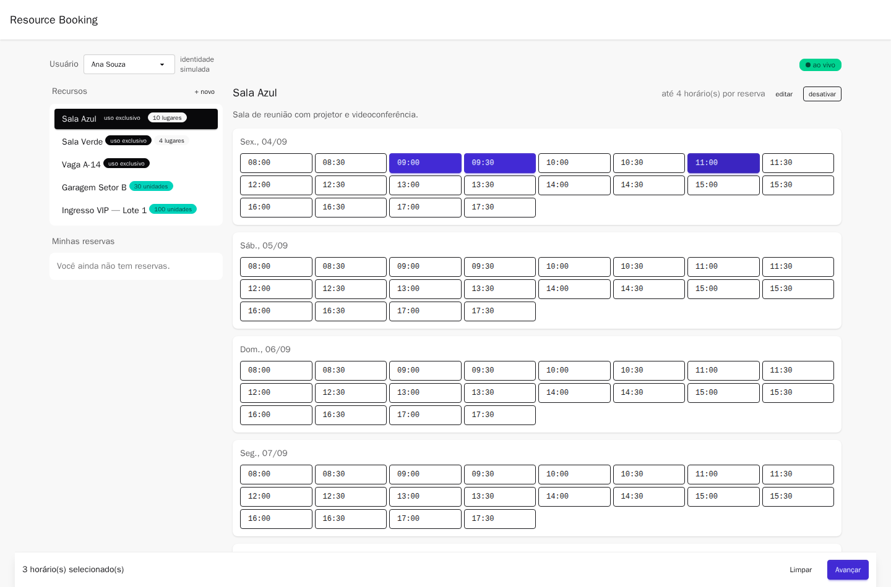
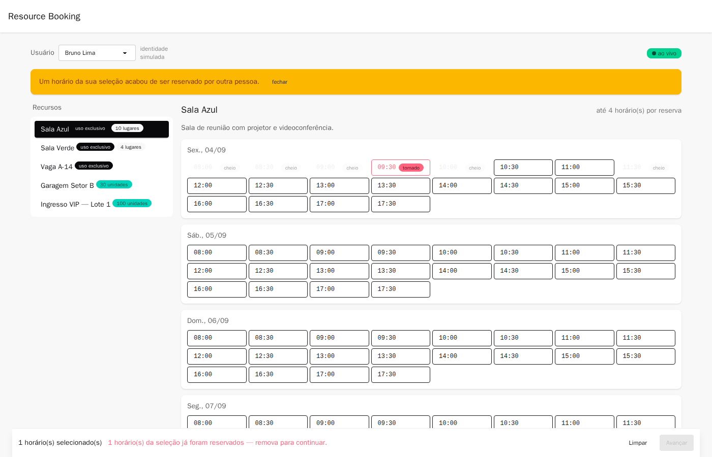
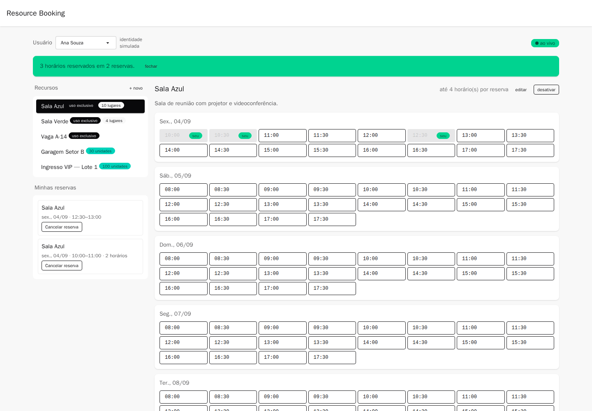

# Resource Booking System

Sistema de reservas de recursos limitados — salas de reunião, vagas de garagem,
ingressos VIP. O problema central não é o CRUD: é que **os recursos são finitos
e disputados**, e o que prova que o sistema funciona é o comportamento quando
várias pessoas tentam a última vaga no mesmo milissegundo.



---

## Como rodar

Pré-requisito: Docker com Compose.

```bash
cp .env.example .env
docker compose up --build              # sobe banco, migra e serve API + frontend
docker compose run --rm --build seed   # popula recursos, horários e usuários
```

| Serviço | URL |
|---|---|
| Dashboard | http://localhost:4200 |
| API | http://localhost:3000/api |
| Liveness | http://localhost:3000/api/health |
| Readiness | http://localhost:3000/api/ready |

O compose sobe cinco serviços: `postgres`, `migrate` (aplica as migrations e
sai), `api`, `web` e `seed` (sob demanda). A API só inicia depois que a
migration termina com sucesso.

> O `--build` no `seed` não é decorativo: o serviço fica atrás de
> `profiles: ['tools']` para não rodar sozinho no `up`, e `docker compose build`
> **ignora serviços com profile**. Sem o `--build`, um `run` posterior pode
> reaproveitar uma imagem defasada.

### Para ver a disputa acontecendo

Abra **duas abas** e escolha usuários diferentes na tela inicial. Selecione o
mesmo horário nas duas e confirme em uma: a outra aba atualiza sozinha e
bloqueia o envio.

### Reserva de vários horários

Marcar horários **seguidos** cria uma reserva só — uma reunião de 2h são 4
slots de 30min. Marcar horários **com lacuna** (09:30 e 13:00) cria reservas
**independentes**, uma por bloco contíguo, cada uma cancelável sozinha
([ADR 0011](docs/adr/0011-reserva-multiplos-slots.md)).

Como blocos são independentes, o resultado pode ser parcial: `201` quando tudo
foi criado, `207` quando parte foi, `409` quando nada foi. O corpo é o mesmo
contrato nos três casos.

### Desenvolvimento local

Requer Node 26 e pnpm 11.

```bash
pnpm install
docker compose up -d postgres
pnpm exec prisma migrate deploy && pnpm exec prisma db seed

pnpm exec nx serve api            # http://localhost:3000/api
pnpm exec nx serve web            # http://localhost:4200
```

### Testes

```bash
pnpm exec nx run-many -t lint test build   # unitários — sem Docker, milissegundos
pnpm exec nx test-integration api          # integração + concorrência (requer Docker)
```

| Suíte | Testes | O que cobre |
|---|---|---|
| Unitários da API | 45 | Regras de domínio com repositórios falsos, agrupamento em blocos, geração de agenda com fuso |
| Integração | 31 | Garantias do Postgres, contra banco real via Testcontainers |
| Frontend | 38 | Reducer puro, store com HTTP e SSE falsos, guard, interceptor |

---

## As duas perguntas do desafio

### 1. Condição de corrida: cinco cliques no mesmo milissegundo

**Resposta curta:** a invariante é garantida pelo **PostgreSQL**, nunca pela
aplicação. A API é stateless e roda em N réplicas — qualquer verificação em
memória de processo é falsa por construção, porque as cinco requisições podem
cair em cinco processos diferentes.

São duas técnicas complementares, escolhidas pelo tipo do recurso:

**Recurso de uso exclusivo** (sala, vaga numerada) — constraint de exclusão:

```sql
ALTER TABLE reservation_slots
  ADD CONSTRAINT reservation_slots_no_overlap
  EXCLUDE USING gist (
    resource_id WITH =,
    tstzrange(starts_at, ends_at, '[)') WITH &&
  ) WHERE (status = 'CONFIRMED' AND exclusive);
```

Os cinco cliques viram cinco `INSERT`. O índice GiST faz o segundo bloquear até
o primeiro commitar, e então falhar. **Não existe leitura prévia a invalidar,
logo não existe janela de corrida.**

A chave é `resource_id`, não `slot_id`. Isso também barra sobreposição entre
janelas *diferentes* do mesmo recurso — o que aconteceria se a agenda fosse
regerada com outra duração de slot.

**Recurso compartilhado** (garagem, lote de ingressos) — `UPDATE` atômico
condicional:

```sql
UPDATE slots
   SET reserved_units = reserved_units + $qty
 WHERE id = $1
   AND reserved_units + $qty <= units_per_slot;
```

A condição e a escrita acontecem no **mesmo statement**, sob o row lock que o
próprio `UPDATE` adquire. `rowsAffected = 0` significa esgotado, e a transação
aborta.

Note o `+ $qty <=` em vez de `< units_per_slot`: com quantidade maior que 1,
checar apenas "sobra alguma unidade" deixaria passar um pedido de 4 quando
restam 2.

**Por que não `SELECT ... FOR UPDATE`.** O fator determinante é o tempo de posse
do lock:

| Técnica | Janela em que a linha fica travada |
|---|---|
| `UPDATE ... WHERE` condicional | duração de um statement (µs) |
| `SELECT ... FOR UPDATE` | do SELECT até o COMMIT — inclui rede e lógica da aplicação (ms) |

Com milhares de clientes na mesma linha, a diferença entre µs e ms de posse é a
diferença entre vazão alta e um comboio de conexões esperando. A escolha melhora
com a contenção, não apesar dela.

**O que mais protege:**

- Transação curta: só o `UPDATE` do contador e o `INSERT` da reserva. O evento
  de tempo real é publicado **depois** do commit.
- `lock_timeout` e `statement_timeout` curtos, com teto no pool de conexões: o
  perdedor falha rápido em vez de empilhar conexão até esgotar o Postgres.
- `CHECK (reserved_units <= units_per_slot)` como rede de segurança contra
  qualquer escrita, inclusive manual.
- Uma reserva agrupa vários horários, e os slots são sempre gravados
  **ordenados por `startsAt`** — ordem global consistente torna deadlock
  impossível por construção.
- Cancelar usa um **portão atômico** (`WHERE status = 'CONFIRMED'`), então
  cancelamentos simultâneos não devolvem unidades em dobro.

**A prova está em [`docs/concurrency.md`](docs/concurrency.md)**, com testes
executáveis: 200 usuários disputando um slot resultam em exatamente 1 sucesso,
199 conflitos e contador em 1.

**O teto que permanece.** Isso garante correção, não vazão ilimitada: o Postgres
serializa escritores na mesma linha. A escada de escalonamento — sharding de
contador, portão de admissão no Redis, fila — está desenhada no
[ADR 0004](docs/adr/0004-estrategia-concorrencia.md) e **não** foi implementada.
O caso de uso fica atrás de uma port para que ela caiba depois sem tocar na
regra de negócio.

### 2. Estado no Angular: falha e atualização sem polling

**Atualização sem polling: SSE.** O fluxo é unidirecional — o servidor sabe
quando a disponibilidade muda, o cliente só precisa ser avisado. `EventSource`
reconecta sozinho, é HTTP puro e atravessa proxy sem configuração. Na
reconexão o cliente **refaz o snapshot**: eventos são otimização de latência, o
`GET` é a fonte da verdade, e o sistema fica correto mesmo perdendo eventos.

**Arquitetura do estado.** Um reducer puro concentra as **duas fontes
concorrentes de mudança** — a ação do usuário e os eventos de terceiros. Não
existe caminho de código que atualize a tela por fora dele, e ele é testável
sem TestBed, sem HTTP e sem browser.

- **RxJS** para o que é assíncrono e composto no tempo: stream do SSE,
  cancelamento, `switchMap` no fetch, `exhaustMap` na submissão.
- **Signals** para o estado lido pelo template, com `OnPush`.

**Quando a reserva falha**, a tela decide pelo `code` do corpo — nunca pela
mensagem, que muda com i18n:

| Resposta | `code` | Reação |
|---|---|---|
| `201` | — | slot vira "seu", aviso de sucesso |
| `409` | `SLOT_UNAVAILABLE` | slot vira "esgotado", **refetch** para reconciliar |
| `409` | `ALREADY_RESERVED` | avisa a reserva existente, **não** mexe na contagem |
| `422` | `SLOT_IN_PAST`, `RESOURCE_INACTIVE`… | aviso de regra + refetch |
| `401` | — | limpa identidade e volta para `/entrar` |
| rede / `5xx` | — | **estado local intacto** e opção de tentar de novo |

Dois `409` distintos precisam de reações distintas: em `SLOT_UNAVAILABLE` a
contagem mudou e a tela precisa reconciliar; em `ALREADY_RESERVED` a contagem
está correta e mexer nela introduziria o erro que se queria evitar. Por isso o
status HTTP sozinho não bastava.

Em falha de **rede** nada é alterado: não sabemos o que aconteceu do outro lado,
e reconciliar seria inventar.

**Três decisões que valem destaque:**

*Atualização pessimista, não otimista.* O slot só muda depois do `201`. Em
recurso disputado, mostrar a vaga como conquistada e retirá-la meio segundo
depois é pior que meio segundo de spinner — a UI estaria mentindo justamente
quando o usuário mais confia nela.

*O clique duplo é impedido na UI*, com botão desabilitado e estado de
carregamento. O `exhaustMap` no store é a segunda linha (descarta cliques com
requisição em voo), e o `Idempotency-Key` é a terceira, para retry de rede.

*Slot selecionado que esgota **permanece** na seleção*, marcado, com o envio
bloqueado. Removê-lo silenciosamente faria o usuário reservar algo diferente do
que estava vendo.



Uma seleção com lacunas resulta em reservas separadas, uma por bloco contíguo,
cada uma com seu próprio card e seu próprio cancelamento:



---

## Decisões arquiteturais e trade-offs

O sistema é um monorepo Nx com NestJS e Angular compartilhando contratos
tipados, e persiste em PostgreSQL via Prisma. A decisão que organiza todas as
outras é **colocar a invariante de negócio no banco, não na aplicação**: como a
API é stateless e replicável (12-Factor VI), qualquer coordenação em memória de
processo é falsa por construção, e por isso a disputa é resolvida por constraint
de exclusão e `UPDATE` atômico condicional em vez de lock pessimista, lock
distribuído ou fila — que foram considerados e recusados por adicionarem
infraestrutura e pontos de falha para uma garantia que o Postgres já dá melhor
(o preço é um teto de vazão por recurso disputado, com a escada de escalonamento
documentada e deliberadamente não implementada). No backend, cada módulo é
hexagonal: os casos de uso dependem de *ports* e não conhecem Prisma nem HTTP,
o que faz as regras de negócio rodarem em milissegundos com repositórios falsos
enquanto as garantias reais são verificadas contra um Postgres de verdade via
Testcontainers — mockar o banco ali não provaria nada, já que um repositório
falso não tem MVCC nem constraint. No frontend, a escolha de um reducer puro com
signals em vez de NgRx troca devtools por menos cerimônia, e a atualização
pessimista troca latência percebida por uma tela que nunca mente. O custo geral
assumido é conhecido e está declarado abaixo, item a item.

**Os ADRs completos estão em [`docs/adr/`](docs/adr/)** — 11 decisões, cada uma
com contexto, alternativas recusadas e o preço pago:

| # | Decisão |
|---|---|
| [0001](docs/adr/0001-monorepo-nx-pnpm.md) | Monorepo Nx integrado, e por que não pnpm workspaces |
| [0002](docs/adr/0002-persistencia-postgres-prisma.md) | PostgreSQL + Prisma |
| [0003](docs/adr/0003-modelo-dominio-slots-fixos.md) | Slots fixos; recursos exclusivos vs. compartilhados |
| [0004](docs/adr/0004-estrategia-concorrencia.md) | **Estratégia de concorrência** |
| [0005](docs/adr/0005-realtime-sse.md) | SSE em vez de WebSocket ou polling |
| [0006](docs/adr/0006-estado-angular.md) | **Gestão de estado no Angular** |
| [0007](docs/adr/0007-tailwind-daisyui.md) | Tailwind + DaisyUI |
| [0008](docs/adr/0008-autenticacao-jwt.md) | Identidade simulada; autenticação diferida |
| [0009](docs/adr/0009-estrategia-testes.md) | Estratégia de testes |
| [0010](docs/adr/0010-doze-fatores.md) | Aderência ao 12-Factor |
| [0011](docs/adr/0011-reserva-multiplos-slots.md) | Reserva de múltiplos horários e anti-deadlock |

### 12-Factor: onde cada fator aparece

| Fator | Onde |
|---|---|
| III — Config | Schema `zod` validado no **boot**; sem `process.env` espalhado; sem default para segredo. Fuso e jornada dos recursos também vêm do ambiente. O frontend recebe config em **runtime** (`env.js`), então a mesma imagem roda em qualquer ambiente |
| IV — Backing services | Postgres alcançado só por `DATABASE_URL`; atrás de ports no código |
| V — Build/release/run | Dockerfiles multi-stage; migrations são serviço separado no compose, nunca no start da API |
| VI — Processos | Nada em memória entre requisições; por isso a concorrência vive no banco |
| IX — Descartabilidade | `/health` e `/ready` distintos; shutdown hooks; `CMD` sem shell |
| XI — Logs | JSON estruturado em stdout |
| XII — Admin | Seed como processo one-off, na mesma imagem |

**Verificando o fator VIII na prática.** O compose principal publica a porta
3000 fixa, porque o browser precisa de um endereço estável — porta fixa e
múltiplas réplicas são incompatíveis, então há um override que transforma a
publicação numa faixa:

```bash
docker compose -f compose.yaml -f infra/docker/compose.scale.yaml \
  up -d --scale api=3
```

Com três processos atendendo o mesmo banco, quatro usuários disputando o mesmo
horário — cada um batendo numa réplica diferente — produzem **1 sucesso e 3
conflitos**, e 40 pedidos concorrentes num recurso compartilhado não geram
overbooking. É a demonstração de que a garantia está no Postgres e não em
memória de processo. Não é balanceamento de carga: para isso entraria um proxy
reverso na frente.

---

## Limitações declaradas

Decisões conscientes de escopo, não descuidos.

**O sistema não é seguro e não pretende ser.** A identidade é simulada: qualquer
cliente pode se passar por qualquer usuário trocando um header. Autenticação
não estava no briefing e foi deliberadamente diferida
([ADR 0008](docs/adr/0008-autenticacao-jwt.md)) para que o tempo fosse para a
concorrência. A troca para JWT toca três pontos — guard, interceptor e uma tela
— e nenhuma regra de negócio.

**SSE não faz fan-out entre réplicas.** O barramento é em memória, local ao
processo: com N réplicas, um evento gerado na réplica A não chega a clientes
conectados na B. O compose sobe uma réplica. A solução é `LISTEN/NOTIFY` ou
Redis pub/sub, e o publisher já está atrás de uma interface para recebê-la.
O sistema permanece **correto** com esse limite, porque o `GET` é a verdade.

**Sem fallback de polling.** Está desenhado no
[ADR 0005](docs/adr/0005-realtime-sse.md) e não implementado. Se o SSE não
conectar, a tela mostra "reconectando" e depende do `EventSource` religar.

**Escalonamento de concorrência não implementado.** Sharding de contador, portão
Redis e fila estão documentados como escada, não como código.

**Horizonte de agenda fixo em 7 dias.** Não há job estendendo a janela conforme
os dias passam; após uma semana sem seed a grade esvazia. Em produção seria um
processo administrativo diário.

**A grade é renderizada no fuso do visitante**, não no fuso de operação. A
jornada é gerada corretamente em horário local do recurso
(`SCHEDULE_TIMEZONE`), mas quem abrir o dashboard de outro país vê os horários
convertidos para o próprio relógio — uma sala das 8h às 18h em São Paulo
aparece das 12h às 22h em Lisboa. Para um recurso físico, mostrar o fuso de
operação com rótulo explícito seria mais claro.

**`kind` e `unitsPerSlot` são imutáveis** após criar o recurso. Reduzir a
capacidade com reservas confirmadas produziria overbooking por edição de
cadastro. Para mudar capacidade, cria-se outro recurso e desativa-se este.

**Componentes de apresentação não têm teste unitário dedicado.** São funções de
estado para markup; o custo/benefício no prazo não fechava. A cobertura vem do
reducer, do store e da verificação em navegador real.

**Acessibilidade** foi auditada com `axe-core` (WCAG 2.1 A/AA) em quatro estados
da aplicação — zero violações — mas não houve teste com leitor de tela real.

**Versões:** NestJS 11 e Prisma 7, não as majors mais recentes. O `@nx/nest`
declara `@nestjs/core <12.0.0`, e a tag `latest` do `prisma` aponta para um
release candidate — colocar um RC na camada que sustenta a garantia de
concorrência seria risco desproporcional. Detalhes no
[ADR 0001](docs/adr/0001-monorepo-nx-pnpm.md).

---

## Stack

| Camada | Escolha |
|---|---|
| Monorepo | Nx 23 (integrado) + pnpm 11 |
| Backend | NestJS 11, módulos hexagonais |
| Banco | PostgreSQL 18 + Prisma 7 |
| Frontend | Angular 22, signals + RxJS |
| Estilo | Tailwind 4 + DaisyUI 5 |
| Testes | Jest, Testcontainers, supertest |

## Estrutura

```
apps/
  api/                     NestJS
    src/config/            env validado no boot
    src/modules/*/         domain · application (ports) · infrastructure · http
    src/shared/realtime/   publisher e endpoint SSE
    prisma/                schema + migrations (constraints manuais)
    test/                  integração e concorrência
  web/                     Angular
    src/app/core/          config, identidade, interceptor, stream SSE
    src/app/features/      dashboard (data · pages · ui)
libs/
  contracts/               tipos compartilhados API ↔ frontend
  testing/                 fakes e builders
docs/
  adr/                     decisões arquiteturais
  concurrency.md           a prova da race condition
```

## Uso de IA

O código foi gerado com assistência de IA, conforme permitido no briefing. As
decisões de arquitetura, os trade-offs, os cortes de escopo e os critérios de
verificação foram definidos e revisados por mim — os ADRs registram o
raciocínio, e vários deles foram **revisados durante a implementação** quando a
prática contradisse o planejado. O histórico de commits acompanha essa
evolução.
